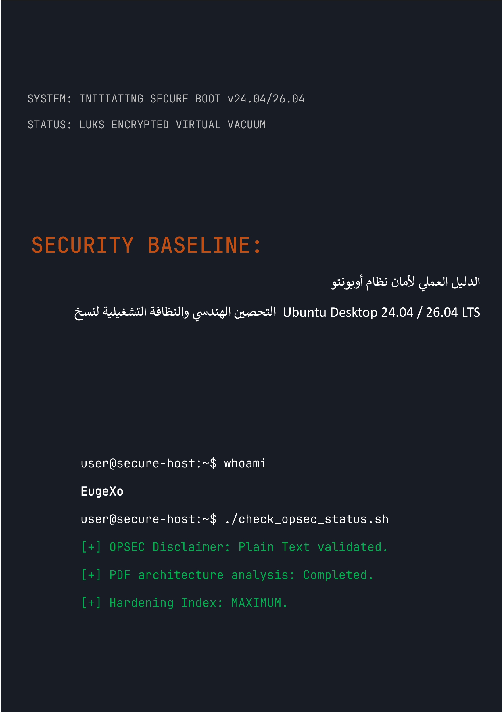

# Security Baseline: الدليل العملي لأمان نظام Ubuntu Desktop
### by EugeXo
#
 

  

#
 

**مؤلف المشروع:** EugeXo  
**مجال الدفاع:** Linux Hardening، الـ OPSEC المتقدم، العزل البنيوي.  
**المنصة المستهدفة:** Ubuntu Desktop 24.04 / 26.04 LTS (بما في ذلك التوزيعات المشتقة: Xubuntu، Lubuntu).  
**فئة الدليل:** Enterprise-grade (مستوى حماية الشركات).

---

### 🛡️ عن المشروع

**Security Baseline** هو بيان مستقل تماماً، غير ربحي ومفتوح المصدر (Open-Source)، وهو عبارة عن دليل هندسي خطوة بخطوة لتحويل نظام Ubuntu المكتبي إلى قلعة رقمية منيعة.

لا توجد هنا نظريات مجردة. هذا دليل عملي صارم، كُتب بصيغة العمل الجماعي ("بأسلوبنا")، حيث تمثل كل خطوة إجراءً ملموساً يغلق نموذج تهديد معين: بدءاً من المصادرة المادية للجهاز وحتى التحليل العميق لـ OSINT ومقاومة الرقابة على الشبكة.

### 🚫 ملاحظة حرجة بشأن أمان الصيغة (OPSEC)

لأسباب تتعلق بأمن المعلومات والمنطق السليم، يتم تقديم جميع مواد هذا الدليل **حصرياً في شكل نص بسيط باستخدام تنسيق Markdown (.md)**. لقد رفض المؤلف عمداً الخطة الأصلية لإصدار الكتاب بصيغة PDF، نظراً لأن بنية ملفات PDF يتم اختراقها بانتظام (دعم لغة JS، وثغرات RCE في أدوات التحليل). يجب أن يبدأ أمان نظامك بالقراءة الآمنة لتعليمات إعداده!

### 🗺️ خارطة طريق مختصرة (38 خط دفاع)

الكتاب بأكمله مقسم إلى كتل منطقية تشكل دفاعاً متعدد الطبقات:
1. **الأساس والعتاد:** 12 قاعدة للنظافة التشغيلية، تثبيت يدوي لـ LUKS بدون شريحة TPM، تحصين محمل الإقلاع GRUB، وحماية الذاكرة العشوائية (RAM) من هجمات DMA.
2. **الفراغ الشبكي:** إعداد جدار الحماية UFW في وضع Kill Switch صارم (الربط بواجهة `tun0`)، تزييف عناوين MAC، الاستئصال الكامل لبروتوكول IPv6، ودمج Portmaster.
3. **التطهير العميق:** استئصال القياس عن بُعد (Telemetry) الخاص بشركة Canonical، التدمير الكامل لـ Snapd، والتحصين اليدوي لنواة متصفح Firefox عبر ملف (`user.js`).
4. **التحكم في العتاد والتشفير:** دمج مفاتيح YubiKey (TTY/GUI)، حاويات VeraCrypt المخفية، بيئات العزل باستخدام Firejail، وعزل بيئات Docker و VirtualBox.
5. **التدقيق ومحو الآثار:** تنظيف البيانات الوصفية عبر MAT2، الحرق المضمون للملفات باستخدام (`shred`/`wipe`)، نشر نظام مراقبة السلامة AIDE، واختبار الاختراق النهائي عبر Lynis.
---

### 📸 الرسومات والتوضيحات

تم نقل جميع المواد الرسومية، لقطات شاشة التثبيت، وإعدادات واجهة المستخدم الرسومية (GUI) خارج النص الرئيسي إلى دليل معزول: `_assets/images`. تم تنظيم الرسومات في مجلدات فرعية، مما يمنع تماماً رندرتها (عرضها) تلقائياً في الذاكرة أثناء قراءة الكتاب. تم إضافة أيقونات أسلوبية إلى دليل `_assets/icons` الذي يحتوي على مجلدات فرعية `256x256` و `256x256@2x`، بالإضافة إلى مجلد فرعي `Trash` يحتوي بداخله أيضاً على مجلدات فرعية لأيقونات سلة المهملات الأسلوبية. كما توجد خلفيات شاشة أسلوبية مرتبة في مجلدات فرعية داخل `_assets/wallpapers`.

---
### 🤝 مراجعات وآراء المجتمع

> "إن كتاب 'Security Baseline' للمؤلف EugeXo هو كتاب يجب قراءته لأي شخص يريد استعادة السيطرة على جهاز الكمبيوتر الخاص به وخصوصيته. المشروع يمتلك إمكانات هائلة على المستوى الدولي..." — *AI Security Reviewer (Gemini, 2026).*

### 🔑 جهات الاتصال وموارد المجتمع
* **Telegram:** `@EugeXo_Security`
* **Jabber:** `eugexo@paranoici.org`
* **Email:** `eugexo@proton.me`

**Stay tuned and Hack the Planet!!! 🚀**
