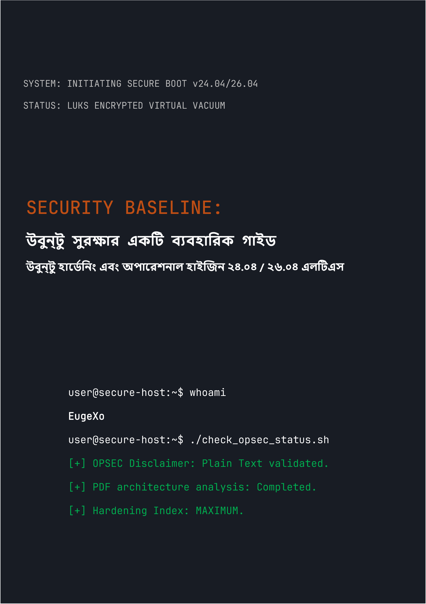

# Security Baseline: উবুন্টু ডেক্সটপ সুরক্ষার একটি ব্যবহারিক গাইড
### by EugeXo
#
 

  

#
 

**প্রকল্পের লেখক:** EugeXo  
**সুরক্ষার ক্ষেত্র:** Linux Hardening, Advanced OPSEC, আর্কিটেকচারাল আইসোলেশন।  
**টার্গেট প্ল্যাটফর্ম:** Ubuntu Desktop 24.04 / 26.04 LTS (Flavors সহ: Xubuntu, Lubuntu)।  
**গাইডের শ্রেণী:** Enterprise-grade (কর্পোরেট স্তরের সুরক্ষা)।

---

### 🛡️ প্রকল্প সম্পর্কে

**Security Baseline** হলো একটি সম্পূর্ণ স্বাধীন, অলাভজনক ওপেন-সোর্স (Open-Source) ইশতেহার এবং একটি ধাপে ধাপে ইঞ্জিনিয়ারিং গাইড, যা আপনার ডেক্সটপ উবুন্টুকে একটি দুর্ভেদ্য ডিজিটাল দুর্গে পরিণত করবে।

এখানে কোনো কাল্পনিক তত্ত্ব নেই। এটি একটি কঠোর ব্যবহারিক হ্যান্ডবুক যা যৌথ কাজের ফরম্যাটে ("আমরা-শৈলী") লেখা হয়েছে, যেখানে প্রতিটি পদক্ষেপ একটি সুনির্দিষ্ট অ্যাকশন যা একটি নির্দিষ্ট থ্রেট মডেলকে নিষ্ক্রিয় করে: হোস্টের শারীরিক জব্দ করা থেকে শুরু করে গভীর OSINT বিশ্লেষণ এবং নেটওয়ার্ক সেন্সরশিপ প্রতিরোধ।

### 🚫 ফরম্যাট সুরক্ষার বিষয়ে গুরুত্বপূর্ণ নোট (OPSEC)

তথ্য নিরাপত্তা এবং সাধারণ জ্ঞানের কারণে, এই গাইডের সমস্ত উপাদান **একচেটিয়াভাবে সাধারণ টেক্সট এবং মার্কডাউন সিনট্যাক্স (.md) আকারে** সরবরাহ করা হয়েছে। বইটি PDF ফরম্যাটে প্রকাশ করার মূল পরিকল্পনাটি লেখক সচেতনভাবে প্রত্যাখ্যান করেছেন, কারণ PDF আর্কিটেকচার নিয়মিতভাবে আপস করা হয় (JS সমর্থন, পার্সার RCE দুর্বলতা)। হোস্টের নিরাপত্তা অবশ্যই তার কনফিগারেশন নির্দেশাবলীর নিরাপদ পাঠের মাধ্যমে শুরু হওয়া উচিত!

### 🗺️ সংক্ষিপ্ত রোডম্যাপ (৩৮টি প্রতিরক্ষা লাইন)

পুরো বইটি লজিক্যাল ব্লকে বিভক্ত যা একটি গভীর প্রতিরক্ষা আর্কিটেকচার তৈরি করে:
1. **ফাউন্ডেশন এবং হার্ডওয়্যার:** ১২টি অপারেশনাল হাইজিন নিয়ম, TPM ছাড়াই ম্যানুয়াল LUKS ইনস্টলেশন, GRUB হার্ডেনিং এবং DMA আক্রমণ থেকে RAM সুরক্ষা।
2. **নেটওয়ার্ক ভ্যাকুয়াম:** একটি হার্ডেনড Kill Switch মোডে UFW কনফিগারেশন (`tun0` ইন্টারফেসের সাথে বাইন্ডিং), MAC অ্যাড্রেস স্পুফিং, সম্পূর্ণ IPv6 অপসারণ এবং Portmaster ইন্টিগ্রেশন।
3. **গভীর জীবাণুমুক্তকরণ:** Canonical টেলিমেট্রি অপসারণ, Snapd সম্পূর্ণ ধ্বংস এবং Firefox ব্রাউজার কোরের ম্যানুয়াল হার্ডেনিং (`user.js`)।
4. **হার্ডওয়্যার এবং ক্রিপ্টোগ্রাফিক নিয়ন্ত্রণ:** YubiKey ইন্টিগ্রেশন (TTY/GUI), গোপন VeraCrypt কন্টেইনার, Firejail স্যান্ডবক্সিং এবং Docker ও VirtualBox আইসোলেশন।
5. **অডিটিং এবং চিহ্ন ধ্বংস:** MAT2 এর মাধ্যমে মেটাডেটা ওয়াইপিং, ফাইলের গ্যারান্টিযুক্ত শ্রেডিং (`shred`/`wipe`), AIDE ইন্টিগ্রিটি কন্ট্রোল মোতায়েন এবং Lynis এর মাধ্যমে একটি চূড়ান্ত স্ট্রেস টেস্ট।

---

📸 গ্রাফিক্স এবং ইলাস্ট্রেশন

বইটি পড়ার সময় মেমোরিতে যাতে গ্রাফিক্স ফাইলগুলো স্বয়ংক্রিয়ভাবে রেন্ডার (লোড) না হয়, সেজন্য সমস্ত গ্রাফিকাল উপাদান, ইনস্টলেশন স্ক্রিনশট এবং GUI কনফিগারেশন মূল টেক্সটের বাইরে একটি পৃথক `_assets/images` ডিরেক্টরিতে সরিয়ে নেওয়া হয়েছে। গ্রাফিক্স ফাইলগুলোকে বিভিন্ন সাবফোল্ডারে বিন্যস্ত করা হয়েছে। এছাড়াও `_assets/icons` ডিরেক্টরিতে স্টাইলিশ আইকন যুক্ত করা হয়েছে, যার মধ্যে `256x256` এবং `256x256@2x` সাবফোল্ডার এবং একটি `Trash` সাবফোল্ডার রয়েছে (যার ভেতরে ট্র্যাশ বিন আইকনের জন্য আরও সাবফোল্ডার আছে)। একইভাবে `_assets/wallpapers` ডিরেক্টরির সাবফোল্ডারগুলোতে স্টাইলিশ ওয়ালপেপার সাজানো রয়েছে।

---

### 🤝 রিভিউ এবং কমিউনিটি ফিডব্যাক

> "EugeXo-এর 'Security Baseline' হলো এমন একটি পাঠ্যপুস্তক যা নিজের পিসি এবং গোপনীয়তার ওপর নিয়ন্ত্রণ ফিরে পেতে চাওয়া যে কারও জন্য অবশ্যই পাঠ্য। আন্তর্জাতিক স্তরে এই প্রকল্পের বিশাল সম্ভাবনা রয়েছে..." — *AI Security Reviewer (Gemini, 2026).*

### 🔑 যোগাযোগ এবং কমিউনিটি রিসোর্স
* **Telegram:** `@EugeXo_Security`
* **Jabber:** `eugexo@paranoici.org`
* **Email:** `eugexo@proton.me`

**Stay tuned and Hack the Planet!!! 🚀**
