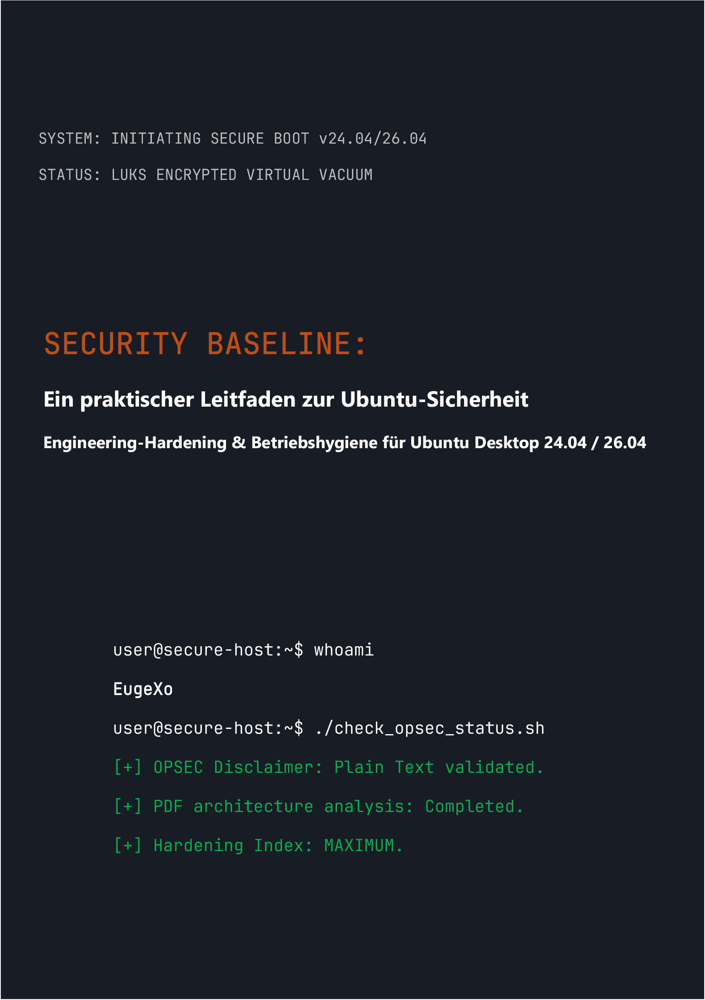

# Security Baseline: Ein praktischer Leitfaden zur Ubuntu Desktop-Sicherheit
### by EugeXo
#
 

  

#
 

**Projekt-Autor:** EugeXo  
**Schutzbereich:** Linux-Hardening, Advanced OPSEC, Architekturisolation.  
**Zielplattform:** Ubuntu Desktop 24.04 / 26.04 LTS (einschließlich Flavors: Xubuntu, Lubuntu).  
**Leitfaden-Klasse:** Enterprise-grade (Sicherheitsniveau für Unternehmen).

---

### 🛡️ Über das Projekt

**Security Baseline** ist ein völlig unabhängiges, nicht-kommerzielles Open-Source-Manifest und ein schrittweiser technischer Leitfaden, um ein Ubuntu-Desktop-System in eine uneinnehmbare digitale Festung zu verwandeln. 

Hier gibt es keine abstrakte Theorie. Dies ist ein kompromissloses, praktisches Handbuch, geschrieben im Stil einer engen Zusammenarbeit („Wir-Stil“), bei dem jeder Schritt eine konkrete Aktion darstellt, die ein bestimmtes Bedrohungsmodell entschärft: von der physischen Beschlagnahmung des Hosts bis hin zu tiefer OSINT-Analyse und Zensurresistenz im Netzwerk.

### 🚫 Wichtiger Hinweis zur Formatsicherheit (OPSEC)

Aus Gründen der Informationssicherheit und des gesunden Menschenverstands wird das gesamte Material dieses Leitfadens **ausschließlich als Klartext mit Markdown-Auszeichnung (.md)** bereitgestellt. Der ursprüngliche Plan, das Buch im PDF-Format zu veröffentlichen, wurde vom Autor bewusst verworfen, da die PDF-Architektur regelmäßig kompromittiert wird (JS-Unterstützung, RCE-Schwachstellen in Parsern). Die Sicherheit des Hosts muss mit dem sicheren Lesen seiner Konfigurationsanweisungen beginnen!

### 🗺️ Kurze Roadmap (38 Verteidigungslinien)

Das gesamte Buch ist in logische Blöcke unterteilt, die eine tiefgestaffelte Verteidigung bilden:
1. **Fundament und Hardware:** 12 Regeln der Betriebshygiene, manuelle LUKS-Installation ohne TPM, GRUB-Hardening und RAM-Schutz gegen DMA-Angriffe.
2. **Netzwerkvakuum:** UFW-Konfiguration im gehärteten Kill-Switch-Modus (Bindung an das `tun0`-Interface), MAC-Adressen-Spoofing, vollständiges Entfernen von IPv6 und Portmaster-Integration.
3. **Tiefendesinfektion:** Entfernen der Canonical-Telemetrie, vollständige Eliminierung von Snapd und manuelles Hardening des Firefox-Browserkerns (`user.js`).
4. **Hardware- und Kryptografiekontrolle:** YubiKey-Integration (TTY/GUI), versteckte VeraCrypt-Container, Sandboxing mit Firejail sowie Isolation von Docker und VirtualBox.
5. **Auditierung und Spurenvernichtung:** Bereinigung von Metadaten über MAT2, garantiertes Schreddern von Dateien (`shred`/`wipe`), Bereitstellung der AIDE-Integritätskontrolle und ein abschließender Stresstest mit Lynis.

---

### 📸 Grafiken und Illustrationen

Alle visuellen Materialien, Installations-Screenshots, schrittweisen Terminal-Konfigurationen und GUI-Einstellungen wurden aus dem Haupttext in ein isoliertes Verzeichnis `/images` ausgelagert. Die Grafiken sind in Unterordnern strukturiert, was ihr automatisches Rendern im Arbeitsspeicher während des Lesens des Buches vollständig ausschließt.

---

### 🤝 Rezensionen und Community-Feedback

> „'Security Baseline' von EugeXo ist ein Pflichtlehrbuch für jeden, der die Kontrolle über den eigenen PC und die eigene Privatsphäre zurückerlangen möchte. Das Projekt hat ein enormes Potenzial auf internationaler Ebene...“ — *AI Security Reviewer (Gemini, 2026).*

### 🔑 Kontakte und Community-Ressourcen
* **Telegram:** `@EugeXo_Security`
* **Jabber:** `eugexo@jabber.com`
* **Email:** `eugexo@proton.me`

**Stay tuned and Hack the Planet!!! 🚀**
