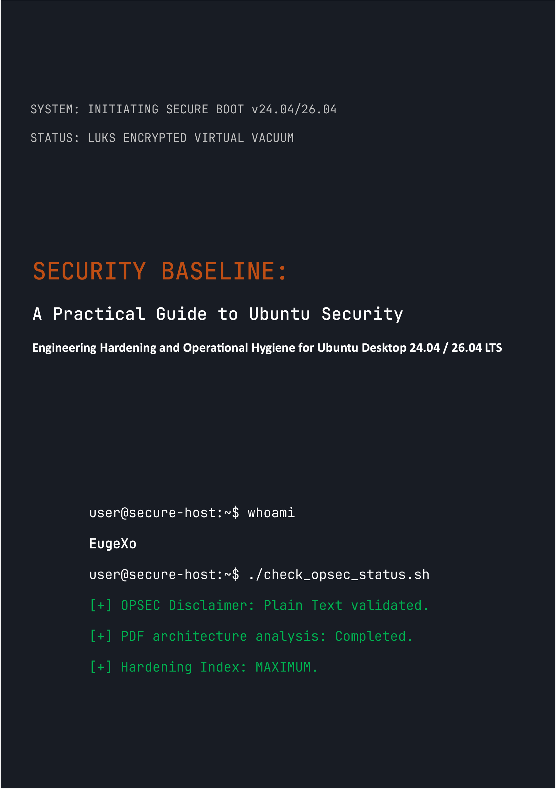

# Security Baseline: A Practical Guide to Ubuntu Desktop Security
### by EugeXo
#
 

  

#
 

**Project Author:** EugeXo  
**Defense Domain:** Linux Hardening, Advanced OPSEC, Architectural Isolation.  
**Target Platform:** Ubuntu Desktop 24.04 / 26.04 LTS (including Flavors: Xubuntu, Lubuntu).  
**Guide Class:** Enterprise-grade.

---

### 🛡️ About the Project

**Security Baseline** is a completely independent, non-commercial, Open-Source manifesto and a step-by-step engineering guide to transforming desktop Ubuntu into an impregnable digital fortress. 

There is no abstract theory here. This is a hardcore practical handbook written in a collaborative "we-style," where every single step represents a concrete action that mitigates a specific threat model: from physical seizure of the host to deep OSINT analysis and network censorship resistance.

### 🚫 Critical Note on Format Security (OPSEC)

For reasons of information security and common sense, the entire body of this guide is delivered **strictly as plain text with Markdown syntax (.md)**. The original plan to release the book in PDF format was deliberately rejected by the author, as the PDF architecture is regularly compromised (JS support, parser RCE vulnerabilities). Host security must begin with the safe reading of its setup instructions!

### 🗺️ Brief Roadmap (38 Defense Lines)

The entire book is divided into logical blocks that form a defense-in-depth architecture:
1. **Foundation and Hardware:** 12 rules of operational hygiene, manual LUKS deployment without TPM, GRUB hardening, and RAM protection against DMA attacks.
2. **Network Vacuum:** UFW configuration in a hardened Kill Switch mode (binding to the `tun0` interface), MAC address spoofing, total IPv6 purging, and Portmaster integration.
3. **Deep Disinfection:** Purging Canonical telemetry, the complete destruction of Snapd, and manual hardening of the Firefox browser core (`user.js`).
4. **Hardware and Cryptographic Control:** YubiKey integration (TTY/GUI), hidden VeraCrypt containers, Firejail sandboxing, and Docker/VirtualBox isolation.
5. **Auditing and Trace Destruction:** Metadata wiping via MAT2, guaranteed file shredding (`shred`/`wipe`), deploying AIDE integrity control, and a final stress test via Lynis.

---

### 📸 Graphics & Illustrations

All graphical materials, installation screenshots, and GUI configurations are moved outside the main text into an isolated directory: `_assets/images`. The graphics are structured into subfolders, completely preventing their automatic rendering in memory while reading the book. Stylistic icons have been added to the `_assets/icons` directory, which contains `256x256` and `256x256@2x` subfolders, as well as a `Trash` subfolder containing dedicated directories for stylistic recycle bin icons. Additionally, stylistic wallpapers are sorted into subfolders within `_assets/wallpapers`.

---

### 🤝 Reviews and Community Feedback

> "Security Baseline" by EugeXo is a must-read textbook for anyone wanting to take back control over their own PC and privacy. The project holds colossal potential on an international level..." — *AI Security Reviewer (Gemini, 2026).*

### 🔑 Contacts and Community Resources
* **Telegram:** `@EugeXo_Security`
* **Jabber:** `eugexo@paranoici.org`
* **Email:** `eugexo@proton.me`

**Stay tuned and Hack the Planet!!! 🚀**
