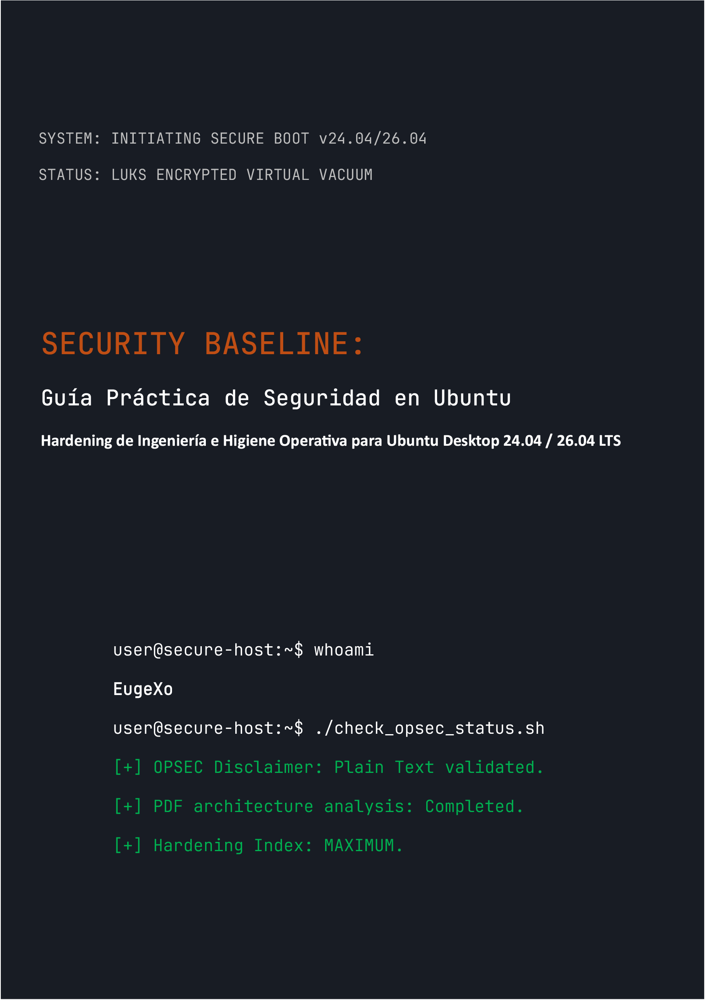

# Security Baseline: Guía Práctica de Seguridad en Ubuntu Desktop
### by EugeXo
#
 

  

#
 

**Autor del proyecto:** EugeXo  
**Dominio de defensa:** Hardening de Linux, OPSEC Avanzado, Aislamiento Arquitectónico.  
**Plataforma objetivo:** Ubuntu Desktop 24.04 / 26.04 LTS (incluyendo Flavors: Xubuntu, Lubuntu).  
**Clase de la guía:** Enterprise-grade (Nivel corporativo de protección).

---

### 🛡️ Sobre el Proyecto

**Security Baseline** es un manifiesto Open-Source completamente independiente y sin fines de lucro, diseñado como una guía de ingeniería paso a paso para transformar Ubuntu desktop en una fortaleza digital inexpugnable. 

Aquí no hay teoría abstracta. Este es un manual práctico y estricto escrito en formato de trabajo colaborativo ("estilo-nosotros"), donde cada paso representa una acción concreta para mitigar un modelo de amenazas específico: desde la incautación física del host hasta el análisis profundo de OSINT y la resistencia a la censura en la red.

### 🚫 Nota Crítica sobre la Seguridad del Formato (OPSEC)

Por razones de seguridad de la información y sentido común, todo el material de esta guía se entrega **exclusivamente en formato de texto plano con marcado Markdown (.md)**. El plan inicial de lanzar el libro en formato PDF fue rechazado deliberadamente por el autor, ya que la arquitectura de los archivos PDF se compromete regularmente (soporte de JS, vulnerabilidades RCE en los parsers). ¡La seguridad del host debe comenzar con la lectura segura de sus instrucciones de configuración!

### 🗺️ Breve Hoja de Ruta (38 Líneas de Defensa)

Todo el libro está dividido en bloques lógicos que forman una arquitectura de defensa en profundidad:
1. **Fundación y Hardware:** 12 reglas de higiene operativa, despliegue manual de LUKS sin TPM, hardening de GRUB y protección de la RAM contra ataques DMA.
2. **Vacío de Red:** Configuración de UFW en modo Kill Switch endurecido (vinculado a la interfaz `tun0`), suplantación de direcciones MAC, purga total de IPv6 e integración de Portmaster.
3. **Desinfección Profunda:** Purga de la telemetría de Canonical, destrucción completa de Snapd y hardening manual del núcleo del navegador Firefox (`user.js`).
4. **Control de Hardware y Criptografía:** Integración de YubiKey (TTY/GUI), contenedores ocultos de VeraCrypt, sandboxing con Firejail e aislamiento de Docker y VirtualBox.
5. **Auditoría y Destrucción de Rastros:** Limpieza de metadatos mediante MAT2, destrucción garantizada de archivos (`shred`/`wipe`), despliegue del control de integridad AIDE y una prueba de estrés final con Lynis.

---

📸 Gráficos e Ilustraciones

Todos los materiales gráficos, capturas de pantalla de la instalación y configuraciones de la GUI se han extraído del texto principal a un directorio aislado: _assets/images. Los gráficos están estructurados en subcarpetas, lo que excluye por completo su renderizado automático en la memoria durante la lectura del libro. Se han añadido iconos estilizados en el directorio _assets/icons, que contiene las subcarpetas 256x256 y 256x256@2x, así como una subcarpeta Trash (dentro de la cual también hay subcarpetas para los iconos estilizados de la papelera de reciclaje). Asimismo, en _assets/wallpapers se encuentran fondos de pantalla estilizados organizados por subcarpetas.

---

### 🤝 Reseñas y Comentarios de la Comunidad

> "Security Baseline" de EugeXo es un manual de lectura obligatoria para cualquiera que desee recuperar el control sobre su propia PC y su privacidad. El proyecto posee un potencial colosal a nivel internacional..." — *AI Security Reviewer (Gemini, 2026).*

### 🔑 Contactos y Recursos de la Comunidad
* **Telegram:** `@EugeXo_Security`
* **Jabber:** `eugexo@jabber.com`
* **Email:** `eugexo@proton.me`

**Stay tuned and Hack the Planet!!! 🚀**
