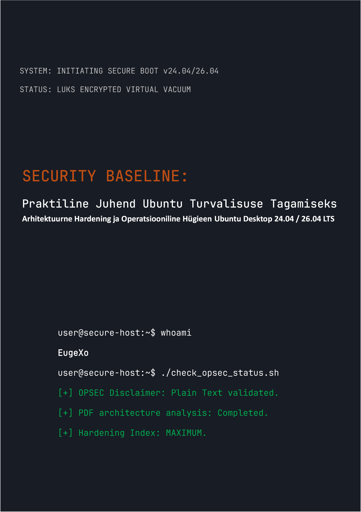

# Security Baseline: Praktiline Juhend Ubuntu Desktop Turvalisuse Tagamiseks
### by EugeXo
#
 

  

#
 

**Projekti autor:** EugeXo  
**Kaitsevaldkond:** Linux Hardening, Kõrgem OPSEC, Arhitektuurne Isolatsioon.  
**Sihtplatvorm:** Ubuntu Desktop 24.04 / 26.04 LTS (sealhulgas Flavors: Xubuntu, Lubuntu).  
**Juhendi klass:** Enterprise-grade (Ettevõttetase kaitseaste).

---

### 🛡️ Projektist

**Security Baseline** on täielikult sõltumatu, mittetulunduslik Open-Source manifest ja samm-sammuline inseneri-juhend, et muuta Sinu Ubuntu töölaud ligipääsmatuks digitaalseks kindluseks. 

Siit ei leia abstraktset teooriat. See on karm praktiline käsiraamat, mis on kirjutatud koostööformaadis ("meie-stiilis"), kus iga samm on konkreetne tegevus kindla ohumudeli maandamiseks: alates hosti füüsilisest arestimisest kuni sügava OSINT-analüüsi ja võrgutsensuurile vastupanuni.

### 🚫 Kriitiline märkus formaadi turvalisuse kohta (OPSEC)

Infoturbe kaalutlustel ja tervest mõistusest lähtuvalt on kogu juhendi materjal kättesaadav **eranditult Markdowni (.md) märgistusega lihttekstina**. Autori algne plaan avaldada raamat PDF-vormingus lükati teadlikult tagasi, kuna PDF-failide arhitektuur on regulaarselt haavatav (JS-tugi, parserite RCE haavatavused). Hosti turvalisus peab algama selle seadistusjuhiste ohutust lugemisest!

### 🗺️ Lühike teekaart (38 kaitseliini)

Kogu raamat on jagatud loogilisteks blokkideks, mis moodustavad süvakaitse arhitektuuri:
1. **Vundament ja Riistvara:** 12 operatsioonilise hügieeni reeglit, käsitsi LUKS-i paigaldamine ilma TPM-ita, GRUB-i hardening ja operatiivmälu kaitse DMA-rünnakute eest.
2. **Võrguvaakum:** UFW seadistamine karmistatud Kill Switch režiimis (sidumine `tun0` liidesega), MAC-aadresside spoofing, IPv6 täielik väljalülitamine ja Portmasteri integreerimine.
3. **Süvadesinfektsioon:** Canonicali telemeetria eemaldamine, Snapd täielik hävitamine ja Firefoxi brauseri tuuma käsitsi hardening (`user.js`).
4. **Riistvara ja Krüptograafiline Kontroll:** YubiKey integreerimine (TTY/GUI), VeraCrypti peidetud konteinerid, liivakastid Firejailiga ning Dockeri ja VirtualBoxi isoleerimine.
5. **Auditeerimine ja Jälgede Hälvitamine:** Metaandmete puhastamine MAT2 abil, failide garanteeritud hävitamine (`shred`/`wipe`), AIDE terviklikkuse kontrolli kasutuselevõtt ja lõplik stressitest Lynise abil.

---

 Graafika ja illustratsioonid

Kõik graafilised materjalid, paigalduse ekraanipildid ja GUI seadistused on viidud väljapoole põhiteksti isoleeritud kataloogi _assets/images. Graafika on struktureeritud alamkaustadesse, mis välistab täielikult selle automaatse mälus renderdamise raamatu lugemise ajal. Kataloogi _assets/icons on lisatud stiiliikoonid, mis sisaldavad alamkaustu 256x256 ja 256x256@2x ning alamkausta Trash, mille sees on omakorda alamkaustad prügikasti stiiliikoonide jaoks. Samuti on kataloogis _assets/wallpapers stiilsed taustapildid jaotatud alamkaustadesse.

---

### 🤝 Arvustused ja Kogukonna Tagasiside

> "EugeXo 'Security Baseline' on kohustuslik lugemismaterjal kõigile, kes soovivad taastada kontrolli oma arvuti ja privaatsuse üle. Projektil on tohutu potentsiaal rahvusvahelisel tasemel..." — *AI Security Reviewer (Gemini, 2026).*

### 🔑 Kontaktid ja Kogukonna Ressursid
* **Telegram:** `@EugeXo_Security`
* **Jabber:** `eugexo@jabber.com`
* **Email:** `eugexo@proton.me`

**Stay tuned and Hack the Planet!!! 🚀**
