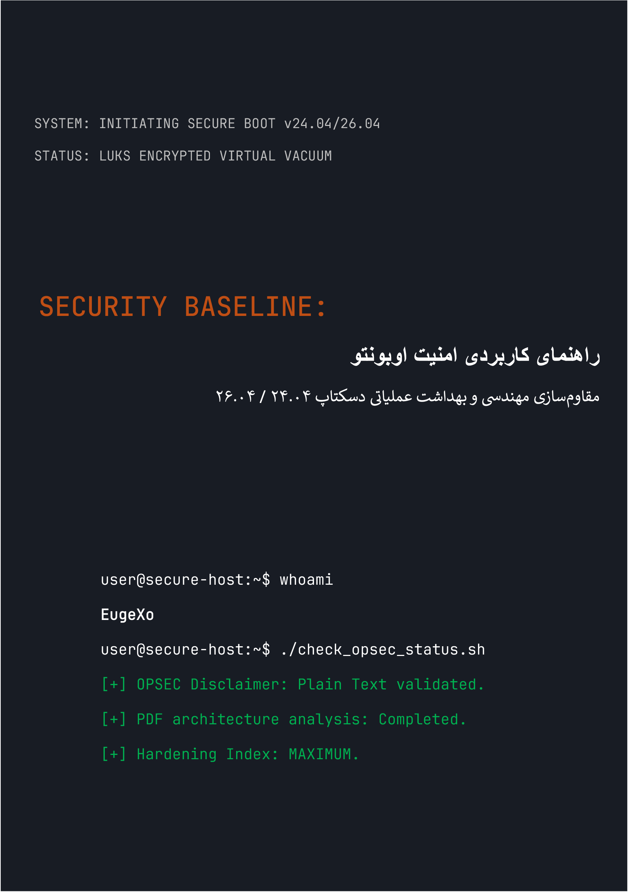

# Security Baseline: راهنمای کاربردی امنیت Ubuntu Desktop
### by EugeXo
#
 

  

#
 

**مؤلف پروژه:** EugeXo  
**حوزه دفاع:** مقاوم‌سازی لینوکس (Linux Hardening)، اوپسک پیشرفته (Advanced OPSEC)، ایزولاسیون معماری.  
**پلتفرم هدف:** Ubuntu Desktop 24.04 / 26.04 LTS (شامل مشتقات: Xubuntu، Lubuntu).  
**کلاس راهنما:** Enterprise-grade (سطح حفاظت سازمانی).

---

### 🛡️ درباره پروژه

**Security Baseline** یک مانیفست کاملاً مستقل، غیرانتفاعی و متن‌باز (Open-Source) و یک راهنمای مهندسی گام‌به‌گام برای تبدیل اوبونتو دسکتاپ به یک دژ دیجیتال نفوذناپذیر است.

در اینجا هیچ تئوری انتزاعی وجود ندارد. این یک کتابچه راهنمای کاربردی و سخت‌گیرانه است که در قالب کار تیمی («سبک ما») نوشته شده است، جایی که هر گام یک اقدام مشخص است که یک مدل تهدید خاص را خنثی می‌کند: از توقیف فیزیکی سیستم تا تحلیل عمیق OSINT و مقاومت در برابر سانسور شبکه.

### 🚫 یادداشت حیاتی درباره امنیت فرمت (OPSEC)

به دلایل امنیت اطلاعات و عقل سلیم، تمام مطالب این راهنما **صرفاً به صورت متن ساده با نشانه‌گذاری Markdown (.md)** ارائه می‌شود. طرح اولیه برای انتشار کتاب در قالب PDF آگاهانه توسط نویسنده رد شد، زیرا معماری فایل‌های PDF به طور منظم آسیب‌پذیر می‌شود (پشتیبانی از JS، آسیب‌پذیری‌های RCE در پارسرها). امنیت سیستم شما باید با خواندن امن دستورالعمل‌های پیکربندی آن آغاز شود!

### 🗺️ نقشه راه مختصر (۳۸ خط دفاعی)

کل کتاب به بخش‌های منطقی تقسیم شده است که یک ساختار دفاعی چندلایه را تشکیل می‌دهند:
1. **پایه و سخت‌افزار:** ۱۲ قانون بهداشت عملیاتی، راه‌اندازی دستی LUKS بدون شریحه TPM، مقاوم‌سازی GRUB و حفاظت از حافظه رم (RAM) در برابر حملات DMA.
2. **خلأ شبکه:** پیکربندی UFW در حالت سخت‌گیرانه Kill Switch (اتصال به اینترفیس `tun0`)، جعل آدرس‌های MAC، حذف کامل IPv6 و ادغام Portmaster.
3. **ضدعفونی عمیق:** حذف تله‌متری Canonical، نابودی کامل Snapd و مقاوم‌سازی دستی هسته مرورگر فایرفاکس (`user.js`).
4. **کنترل سخت‌افزاری و رمزنگاری:** ادغام کلیدهای YubiKey (TTY/GUI)، کانتینرهای پنهان VeraCrypt، محیط‌های ایزوله Firejail و جداسازی محیط‌های Docker و VirtualBox.
5. **حسابرسی و پاکسازی ردپاها:** پاکسازی متاداده‌ها از طریق MAT2، امحای تضمینی فایل‌ها با (`shred`/`wipe`)، استقرار سیستم کنترل یکپارچگی AIDE و تست استرس نهایی از طریق Lynis.

---

📸 گرافیک و تصاویر
به منظور جلوگیری کامل از رندر شدن خودکار تصاویر در حافظه (RAM) هنگام خواندن کتاب، تمامی مطالب گرافیکی، اسکرین‌شات‌های نصب و تنظیمات محیط گرافیکی (GUI) به یک دایرکتوری مجزا به آدرس _assets/images منتقل شده‌اند. این تصاویر در پوشه‌های فرعی ساختاردهی شده‌اند. همچنین آیکون‌های استایل‌بندی شده به دایرکتوری _assets/icons اضافه شده‌اند که شامل پوشه‌های فرعی 256x256 و 256x256@2x و یک پوشه فرعی به نام Trash است (که در داخل آن نیز پوشه‌های فرعی برای آیکون‌های سطل زباله قرار دارد). به همین ترتیب، در دایرکتوری _assets/wallpapers تصاویر پس‌زمینه استایل‌بندی شده در پوشه‌های فرعی مرتب شده‌اند.

---

### 🤝 نظرات و بازخوردهای جامعه

> «کتاب "Security Baseline" اثر EugeXo یک کتاب درسی ضروری برای هر کسی است که می‌خواهد کنترل رایانه شخصی و حریم خصوصی خود را پس بگیرد. این پروژه پتانسیل عظیمی در سطح بین‌المللی دارد...» — *AI Security Reviewer (Gemini, 2026).*

### 🔑 راه‌های ارتباطی و منابع جامعه
* **Telegram:** `@EugeXo_Security`
* **Jabber:** `eugexo@jabber.com`
* **Email:** `eugexo@proton.me`

**Stay tuned and Hack the Planet!!! 🚀**
