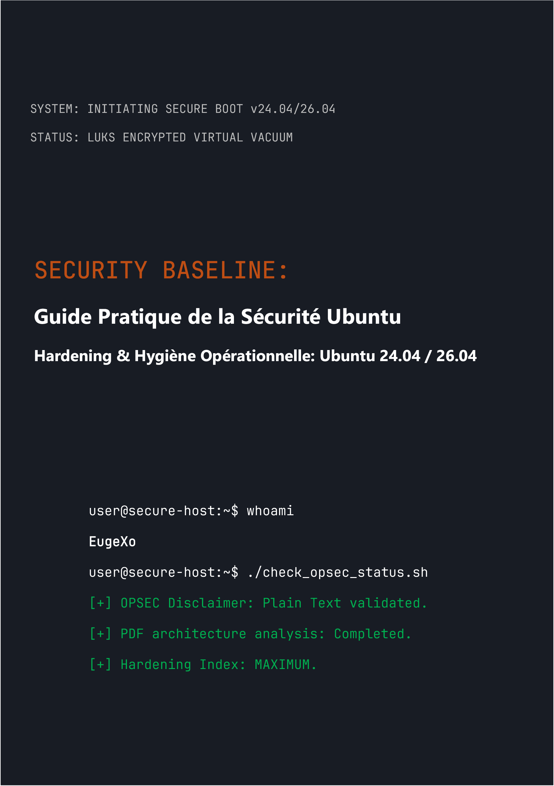

# Security Baseline: Guide Pratique de la Sécurité Ubuntu Desktop
### by EugeXo
#
 

  

#
 

**Auteur du projet :** EugeXo  
**Domaine de défense :** Hardening Linux, OPSEC Avancé, Isolation Architecturale.  
**Plateforme cible :** Ubuntu Desktop 24.04 / 26.04 LTS (y compris les Flavors : Xubuntu, Lubuntu).  
**Classe du guide :** Enterprise-grade (Niveau de protection entreprise).

---

### 🛡️ À propos du Projet

**Security Baseline** est un manifeste Open-Source complètement indépendant et non commercial, conçu comme un guide d'ingénierie étape par étape pour transformer Ubuntu desktop en une forteresse digitale imprenable. 

Ici, pas de théorie abstraite. C'est un manuel pratique et rigoureux écrit dans un format de travail collaboratif (« style-nous »), où chaque étape représente une action concrète atténuant un modèle de menace spécifique : de la saisie physique de l'hôte à l'analyse approfondie OSINT et à la résistance à la censure sur le réseau.

### 🚫 Note Critique sur la Sécurité du Format (OPSEC)

Pour des raisons de sécurité de l'information et de bon sens, l'ensemble du matériel de ce guide est fourni **exclusivement sous forme de texte brut avec balisage Markdown (.md)**. Le plan initial de publier le livre au format PDF a été délibérément rejeté par l'auteur, car l'architecture des fichiers PDF est régulièrement compromise (support JS, vulnérabilités RCE dans les parseurs). La sécurité de l'hôte doit commencer par la lecture sécurisée de ses instructions de configuration !

### 🗺️ Brève Feuille de Route (38 Lignes de Défense)

L'ensemble du livre est divisé en blocs logiques formant une architecture de défense en profondeur :
1. **Fondation et Matériel :** 12 règles d'hygiène opérationnelle, déploiement manuel de LUKS sans TPM, hardening de GRUB et protection de la RAM contre les attaques DMA.
2. **Vide Réseau :** Configuration d'UFW en mode Kill Switch durci (liaison à l'interface `tun0`), usurpation d'adresses MAC, purge totale d'IPv6 et intégration de Portmaster.
3. **Désinfection Profonde :** Purge de la télémétrie de Canonical, destruction complète de Snapd et hardening manuel du cœur du navigateur Firefox (`user.js`).
4. **Contrôle Matériel et Cryptographique :** Intégration d'YubiKey (TTY/GUI), conteneurs cachés VeraCrypt, sandboxing avec Firejail et isolation de Docker et VirtualBox.
5. **Audit et Destruction des Traces :** Nettoyage des métadonnées via MAT2, destruction garantie des fichiers (`shred`/`wipe`), déploiement du contrôle d'intégrité AIDE et test de stress final via Lynis.

---

### 📸 Graphismes & Illustrations

Tous los documents graphiques, captures d'écran d'installation et configurations GUI ont été déplacés en dehors du texte principal dans un répertoire isolé : `_assets/images`. Les graphismes sont structurés en sous-dossiers, ce qui exclut totalement leur rendu automatique en mémoire lors de la lecture du livre. Des icônes stylisées ont été ajoutées dans le répertoire `_assets/icons`, qui contient les sous-dossiers `256x256` y `256x256@2x`, ainsi qu'un sous-dossier `Trash` (qui contient lui-même des sous-dossiers pour les icônes stylisées de la corbeille). De plus, des fonds d'écran stylisés sont répartis dans des sous-dossiers au sein de `_assets/wallpapers`.

---

### 🤝 Critiques et Retours de la Communauté

> « "Security Baseline" d'EugeXo est un manuel de lecture obligatoire pour quiconque souhaite reprendre le contrôle de son propre PC et de sa vie privée. Le projet possède un potentiel colossal à l'échelle internationale... » — *AI Security Reviewer (Gemini, 2026).*

### 🔑 Contacts et Ressources de la Communauté
* **Telegram :** `@EugeXo_Security`
* **Jabber :** `eugexo@paranoici.org`
* **Email :** `eugexo@proton.me`

**Stay tuned and Hack the Planet!!! 🚀**
