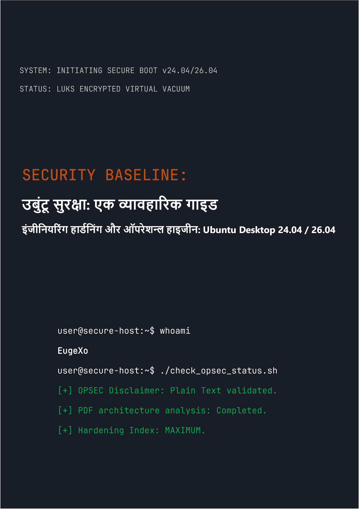

# Security Baseline: उबुंटू डेस्कटॉप सुरक्षा के लिए एक व्यावहारिक गाइड
### by EugeXo
#
 

  

#
 

**परियोजना लेखक:** EugeXo  
**सुरक्षा क्षेत्र:** Linux Hardening, Advanced OPSEC, आर्किटेक्चरल आइसोलेशन।  
**लक्षित प्लेटफॉर्म:** Ubuntu Desktop 24.04 / 26.04 LTS (Flavors सहित: Xubuntu, Lubuntu)।  
**गाइड श्रेणी:** Enterprise-grade (कॉर्पोरेट स्तर की सुरक्षा)।

---

### 🛡️ परियोजना के बारे में

**Security Baseline** एक पूरी तरह से स्वतंत्र, गैर-व्यावसायिक ओपन-सोर्स (Open-Source) घोषणापत्र और एक चरण-दर-चरण इंजीनियरिंग गाइड है, जो आपके डेस्कटॉप उबुंटू को एक अभेद्य डिजिटल किले में बदल देगा।

यहाँ कोई काल्पनिक सिद्धांत नहीं हैं। यह एक कठोर व्यावहारिक हैंडबुक है जिसे सहयोगात्मक कार्य प्रारूप ("हम-शैली") में लिखा गया है, जहाँ हर कदम एक ठोस कार्रवाई है जो एक विशिष्ट थ्रेट मॉडल को बंद करती है: होस्ट की भौतिक जब्ती से लेकर गहरे OSINT विश्लेषण और नेटवर्क सेंसरशिप प्रतिरोध तक।

### 🚫 प्रारूप सुरक्षा पर महत्वपूर्ण नोट (OPSEC)

सूचना सुरक्षा और सामान्य ज्ञान के कारणों से, इस गाइड की सभी सामग्री **विशेष रूप से मार्कडाउन सिंटैक्स (.md) के साथ साधारण टेक्स्ट के रूप में** प्रदान की जाती है। पुस्तक को PDF प्रारूप में जारी करने की मूल योजना को लेखक द्वारा जानबूझकर खारिज कर दिया गया था, क्योंकि PDF आर्किटेक्चर नियमित रूप से हैक हो जाता है (JS समर्थन, पार्सर RCE कमजोरियां)। होस्ट की सुरक्षा हमेशा उसके कॉन्फ़िगरेशन निर्देशों के सुरक्षित पढ़ने के साथ शुरू होनी चाहिए!

### 🗺️ संक्षिप्त रोडमैप (38 रक्षा पंक्तियाँ)

पूरी पुस्तक को तार्किक ब्लॉकों में विभाजित किया गया है जो एक गहरी रक्षा वास्तुकला (defense-in-depth) बनाते हैं:
1. **फाउंडेशन और हार्डवेयर:** 12 ऑपरेशन्ल हाइजीन नियम, बिना TPM के मैनुअल LUKS इंस्टॉलेशन, GRUB हार्डनिंग और DMA हमलों से RAM सुरक्षा।
2. **नेटवर्क वैक्यूम:** एक हार्डनड Kill Switch मोड में UFW कॉन्फ़िगरेशन (`tun0` इंटरफ़ेस के साथ बाइंडिंग), MAC एड्रेस स्पूफिंग, पूर्ण IPv6 निष्कासन और Portmaster एकीकरण।
3. **गहरी कीटाणुशोधन:** Canonical टेलीमेट्री को हटाना, Snapd का पूर्ण विनाश और Firefox ब्राउज़र कोर की मैनुअल हार्डनिंग (`user.js`)।
4. **हार्डवेयर और क्रिप्टोग्राफिक नियंत्रण:** YubiKey एकीकरण (TTY/GUI), छिपे हुए VeraCrypt कंटेनर, Firejail सैंडबॉक्सिंग और Docker व VirtualBox आइसोलेशन।
5. **ऑडिटिंग और निशानों का विनाश:** MAT2 के माध्यम से मेटाडेटा वाइपिंग, फाइलों का गारंटीकृत विनाश (`shred`/`wipe`), AIDE अखंडता नियंत्रण की तैनाती और Lynis के माध्यम से एक अंतिम स्ट्रेस टेस्ट।

---

📸 ग्राफिक्स और चित्र (Illustrations)

किताब पढ़ने के दौरान मेमोरी में ग्राफिक्स फ़ाइलों के ऑटोमैटिक रेंडर (लोड) होने की संभावना को पूरी तरह से रोकने के लिए, सभी ग्राफिकल सामग्री, इंस्टॉलेशन स्क्रीनशॉट और GUI कॉन्फ़िगरेशन को मुख्य टेक्स्ट से हटाकर एक अलग _assets/images डायरेक्टरी में सुरक्षित रखा गया है। ग्राफिक्स को सबफ़ोल्डर्स में व्यवस्थित किया गया है। इसके अलावा, _assets/icons डायरेक्टरी में स्टाइलिश आइकन जोड़े गए हैं, जिसमें 256x256 और 256x256@2x सबफ़ोल्डर्स और एक Trash सबफ़ोल्डर शामिल है (जिसके अंदर रीसायकल बिन के स्टाइलिश आइकन के लिए और भी सबफ़ोल्डर्स हैं)। इसी तरह, _assets/wallpapers में स्टाइलिश वॉलपेपर भी सबफ़ोल्डर्स में विभाजित करके रखे गए हैं।

---

### 🤝 समीक्षाएं और समुदाय की प्रतिक्रिया

> "EugeXo की 'Security Baseline' अपने पीसी और गोपनीयता पर नियंत्रण वापस पाने के इच्छुक किसी भी व्यक्ति के लिए एक अनिवार्य पाठ्यपुस्तक है। अंतर्राष्ट्रीय स्तर पर इस परियोजना में भारी संभावनाएं हैं..." — *AI Security Reviewer (Gemini, 2026).*

### 🔑 संपर्क और समुदाय के संसाधन
* **Telegram:** `@EugeXo_Security`
* **Jabber:** `eugexo@jabber.com`
* **Email:** `eugexo@proton.me`

**Stay tuned and Hack the Planet!!! 🚀**
