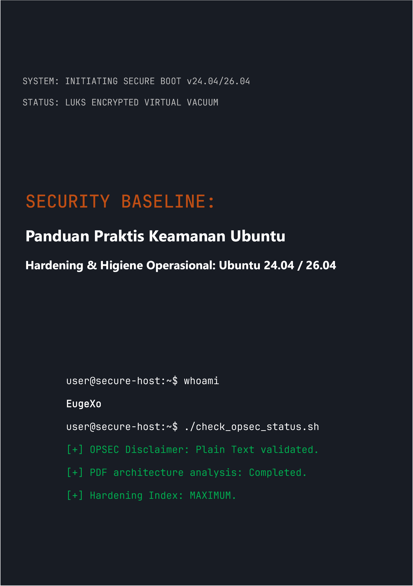

# Security Baseline: Panduan Praktis Keamanan Ubuntu Desktop
### by EugeXo
#
 

  

#
 

**Penulis Proyek:** EugeXo  
**Domain Pertahanan:** Hardening Linux, Advanced OPSEC, Isolasi Arsitektural.  
**Platform Target:** Ubuntu Desktop 24.04 / 26.04 LTS (termasuk Flavors: Xubuntu, Lubuntu).  
**Kelas Panduan:** Enterprise-grade (Tingkat perlindungan korporat).

---

### 🛡️ Tentang Proyek

**Security Baseline** adalah manifesto Open-Source yang sepenuhnya independen, non-komersial, dan panduan rekayasa langkah-demi-langkah untuk mengubah desktop Ubuntu menjadi benteng digital yang tidak dapat tertembus. 

Tidak ada teori abstrak di sini. Ini adalah buku panduan praktis yang keras dan ditulis dalam format kerja kolaboratif ("gaya-kita"), di mana setiap langkah mewakili tindakan nyata yang menutup model ancaman tertentu: mulai dari penyitaan fisik host hingga analisis OSINT mendalam dan resistensi sensor jaringan.

### 🚫 Catatan Kritis pada Keamanan Format (OPSEC)

Untuk alasan keamanan informasi dan akal sehat, seluruh materi panduan ini disediakan **secara eksklusif dalam bentuk teks biasa dengan sintaks Markdown (.md)**. Rencana awal untuk merilis buku dalam format PDF sengaja ditolak oleh penulis, karena arsitektur PDF secara teratur dikompromikan (dukungan JS, kerentanan RCE pada parser). Keamanan host harus dimulai dengan pembacaan instruksi konfigurasi secara aman!

### 🗺️ Peta Jalan Singkat (38 Lini Pertahanan)

Seluruh buku dibagi menjadi blok-blok logis yang membentuk arsitektur defense-in-depth:
1. **Fondasi dan Perangkat Keras:** 12 aturan higiene operasional, instalasi LUKS manual tanpa TPM, hardening GRUB, dan perlindungan RAM terhadap serangan DMA.
2. **Vakum Jaringan:** Konfigurasi UFW dalam mode Kill Switch yang diperkeras (mengikat ke antarmuka `tun0`), spoofing alamat MAC, pembersihan total IPv6, dan integrasi Portmaster.
3. **Desinfeksi Mendalam:** Pembersihan telemetri Canonical, penghancuran total Snapd, dan hardening manual pada inti browser Firefox (`user.js`).
4. **Kontrol Perangkat Keras dan Kriptografi:** Integrasi YubiKey (TTY/GUI), kontainer VeraCrypt tersembunyi, sandboxing dengan Firejail, serta isolasi Docker dan VirtualBox.
5. **Audit dan Penghancuran Jejak:** Pembersihan metadata via MAT2, penghancuran file yang dijamin (`shred`/`wipe`), penerapan kontrol integritas AIDE, dan pengujian stres akhir melalui Lynis.

---

### 📸 Grafis & Ilustrasi

Semua materi grafis, tangkapan layar instalasi, dan konfigurasi GUI telah dipindahkan dari teks utama ke direktori terisolasi: `_assets/images`. Grafis tersebut distrukturkan ke dalam subfolder, yang sepenuhnya mencegah proses rendering otomatis di dalam memori saat buku sedang dibaca. Ikon-ikon bergaya (stylistic) telah ditambahkan ke direktori `_assets/icons`, yang berisi subfolder `256x256` dan `256x256@2x`, serta subfolder `Trash` (di mana di dalamnya juga terdapat subfolder untuk ikon bergaya keranjang sampah). Selain itu, di dalam `_assets/wallpapers` terdapat juga wallpaper bergaya yang dibagi ke dalam subfolder.

---

### 🤝 Ulasan dan Umpan Balik Komunitas

> "Security Baseline oleh EugeXo adalah buku teks yang wajib dibaca bagi siapa saja yang ingin mengambil alih kembali kendali atas PC dan privasi mereka sendiri. Proyek ini memiliki potensi kolosal di tingkat internasional..." — *AI Security Reviewer (Gemini, 2026).*

### 🔑 Kontak dan Sumber Daya Komunitas
* **Telegram:** `@EugeXo_Security`
* **Jabber:** `eugexo@paranoici.org`
* **Email:** `eugexo@proton.me`

**Stay tuned and Hack the Planet!!! 🚀**
