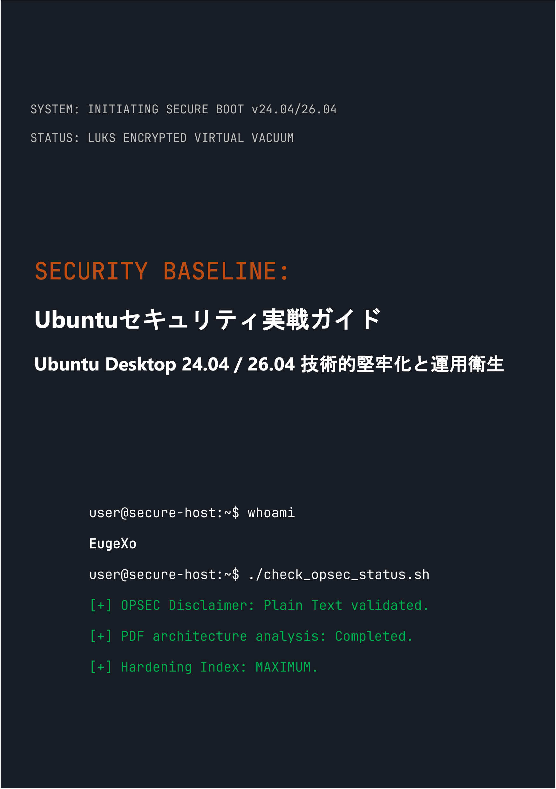

# Security Baseline: Ubuntu Desktopセキュリティ実戦ガイド
### by EugeXo
#
 

  

#
 

**プロジェクト著者:** EugeXo  
**防御領域:** Linux Hardening, Advanced OPSEC, アーキテクチャの隔離。  
**対象プラットフォーム:** Ubuntu Desktop 24.04 / 26.04 LTS (Xubuntu, Lubuntu等のFlavorsを含む)。  
**ガイドのクラス:** Enterprise-grade (企業向けの保護レベル)。

---

### 🛡️ プロジェクトについて

**Security Baseline**は、完全に独立した非営利のオープンソース（Open-Source）マニフェストであり、デスクトップUbuntuを難攻不落のデジタル要塞へと変貌させるためのステップバイステップのエンジニアリングガイドです。

ここには抽象的な理論はありません。これは、共同作業形式（「私たちスタイル」）で書かれた厳格な実践ハンドブックであり、各ステップは、ホストの物理的押収から深いOSINT分析、ネットワーク検閲への耐性に至るまで、特定の脅威モデルを排除する具体的なアクションで構成されています。

### 🚫 フォーマットの安全性に関する重要な注意（OPSEC）

情報セキュリティと常識的な観点から、本ガイドのすべての資料は**Markdown（.md）構文を使用したプレーンテキスト形式のみ**で提供されます。PDFファイルは、そのアーキテクチャ（JSサポート、パーサーのRCE脆弱性など）が定期的に侵害されるため、本書をPDF形式でリリースする当初の計画は著者によって意図的に却下されました。ホストのセキュリティは、その設定手順を安全に読み取ることから始まる必要があります！

### 🗺️ 短期ロードマップ（38の防御ライン）

本書全体は、多層防御（defense-in-depth）アーキテクチャを形成する論理ブロックに分割されています：
1. **基盤とハードウェア:** 12の運用衛生ルール、TPMを使用しない手動LUKSインストール、GRUBの堅牢化、およびDMA攻撃からのRAM保護。
2. **ネットワーク真空:** 要塞化されたKill Switchモード（`tun0`インターフェースへのバインド）でのUFW設定、MACアドレスのスプーフィング、IPv6の完全な排除、およびPortmasterの統合。
3. **ディープ消毒:** Canonicalテレメトリの排除、Snapdの完全な破壊、およびFirefoxブラウザコアの手動堅牢化（`user.js`）。
4. **ハードウェアと暗号化の制御:** YubiKey統合（TTY/GUI）、隠しVeraCryptコンテナ、Firejailによるサンドボックス化、DockerおよびVirtualBoxの隔離。
5. **監査と痕跡消去:** MAT2によるメタデータの削除、ファイルの確実な消去（`shred`/`wipe`）、AIDE整合性監視の展開、およびLynisによる最終ストレスチェック。

---

### 📸 グラフィックスとイラスト

すべての視覚資料、インストール画面のスクリーンショット、ステップバイステップのターミナル設定、およびGUI設定は、本文から切り離され、隔離されたディレクトリ`/images`に移動されています。グラフィックスはサブフォルダに構造化されており、本書の読込中にメモリ内で自動レンダリングされることを完全に防ぎます。

---

### 🤝 レビューとコミュニティのフィードバック

> 「EugeXoによる『Security Baseline』は、自身のPCとプライバシーの制御を取り戻したいと考えているすべての人にとって必読の教科書です。このプロジェクトは国際レベルで巨大な可能性を秘めています...」 — *AI Security Reviewer (Gemini, 2026).*

### 🔑 連絡先とコミュニティリソース
* **Telegram:** `@EugeXo_Security`
* **Jabber:** `eugexo@jabber.com`
* **Email:** `eugexo@proton.me`

**Stay tuned and Hack the Planet!!! 🚀**
