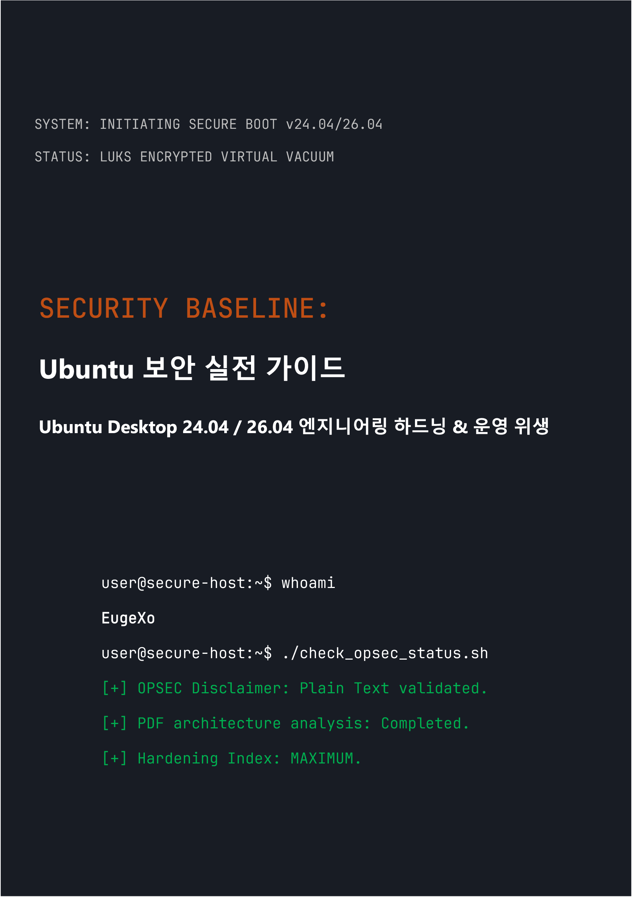

# Security Baseline: Ubuntu Desktop 보안 실전 가이드
### by EugeXo
#
 

  

#
 

**프로젝트 저자:** EugeXo  
**방어 영역:** Linux Hardening, Advanced OPSEC, 아키텍처 격리.  
**대상 플랫폼:** Ubuntu Desktop 24.04 / 26.04 LTS (Xubuntu, Lubuntu 등 Flavors 포함).  
**가이드 등급:** Enterprise-grade (기업 요구 수준의 보안).

---

### 🛡️ 프로젝트 소개

**Security Baseline**은 완전히 독립적이고 비상업적인 오픈소스(Open-Source) 선언문이자, 데스크톱 Ubuntu를 난공불락의 디지털 요새로 탈바꿈하기 위한 단계별 엔지니어링 가이드입니다.

여기에는 추상적인 이론이 없습니다. 공동 작업 형식("우리 스타일")으로 작성된 철저한 실무 핸드북이며, 각 단계는 호스트의 물리적 압수부터 심층 OSINT 분석 및 네트워크 검열 저항에 이르기까지 특정 위협 모델을 차단하는 구체적인 조치로 구성되어 있습니다.

### 🚫 포맷 보안에 관한 중요한 주의사항 (OPSEC)

정보 보안과 상식적인 이유로, 본 가이드의 모든 자료는 **정확히 Markdown(.md) 구문을 사용한 플레인 텍스트 형식으로만 제공**됩니다. PDF 파일은 해당 아키텍처(JS 지원, 파서의 RCE 취약점 등)가 정기적으로 침해되기 때문에, 본서를 PDF 형식으로 출시하려던 원래 계획은 저자에 의해 의도적으로 기각되었습니다. 호스트 보안은 구성 지침을 안전하게 읽는 것부터 시작해야 합니다!

### 🗺️ 핵심 로드맵 (38개의 방어선)

책 전체는 심층 방어(defense-in-depth) 아키텍처를 형성하는 논리적 블록으로 나뉩니다:
1. **기반 및 하드웨어:** 12가지 운영 위생 규칙, TPM 없는 수동 LUKS 설치, GRUB 하드닝, DMA 공격으로부터 RAM 보호.
2. **네트워크 진공:** 강화된 Kill Switch 모드(`tun0` 인터페이스 바인딩)로 UFW 구성, MAC 주소 스푸핑, IPv6 완전 제거 및 Portmaster 통합.
3. **심층 디톡스:** Canonical 텔레메트리 제거, Snapd 완전 파괴 및 Firefox 브라우저 코어 수동 하드닝(`user.js`).
4. **하드웨어 및 암호화 제어:** YubiKey 통합(TTY/GUI), 숨겨진 VeraCrypt 컨테이너, Firejail 기반 샌드박싱, Docker 및 VirtualBox 격리.
5. **감사 및 흔적 제거:** MAT2를 통한 메타데이터 와이핑, 파일 영구 삭제(`shred`/`wipe`), AIDE 무결성 모니터링 배포 및 Lynis를 통한 최종 스트레스 테스트.

---

### 📸 그래픽 및 일러스트

모든 시각 자료, 설치 스크린샷, 단계별 터미널 설정 및 GUI 설정은 본문에서 격리되어 별도의 `/images` 디렉토리로 이동되었습니다. 그래픽은 하위 폴더로 구조화되어 있어, 책을 읽는 동안 메모리 내에서 자동 렌더링되는 것을 완전히 방지합니다.

---

### 🤝 리뷰 및 커뮤니티 피드백

> "EugeXo의 'Security Baseline'은 자신의 PC와 개인정보에 대한 통제권을 되찾고자 하는 모든 이들이 반드시 읽어야 할 교과서입니다. 이 프로젝트는 국제적 수준에서 엄청난 잠재력을 가지고 있습니다..." — *AI Security Reviewer (Gemini, 2026).*

### 🔑 연락처 및 커뮤니티 리소스
* **Telegram:** `@EugeXo_Security`
* **Jabber:** `eugexo@jabber.com`
* **Email:** `eugexo@proton.me`

**Stay tuned and Hack the Planet!!! 🚀**
