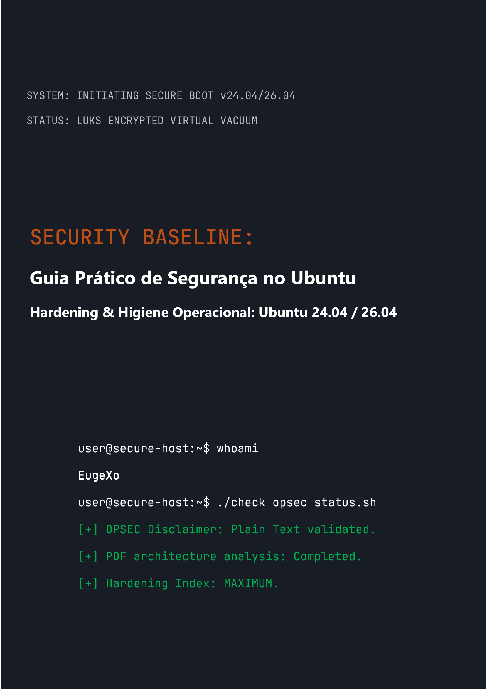

# Security Baseline: Guia Prático de Segurança no Ubuntu Desktop
### by EugeXo
#
 

  

#
 

**Autor do Projeto:** EugeXo  
**Domínio de Defesa:** Hardening Linux, OPSEC Avançado, Isolamento Arquitetural.  
**Plataforma Alvo:** Ubuntu Desktop 24.04 / 26.04 LTS (incluindo Flavors: Xubuntu, Lubuntu).  
**Classe do Guia:** Enterprise-grade (Nível de proteção corporativo).

---

### 🛡️ Sobre o Projeto

**Security Baseline** é um manifesto Open-Source totalmente independente e sem fins lucrativos, projetado como um guia de engenharia passo a passo para transformar o Ubuntu desktop em uma fortaleza digital inexpugnável. 

Não há teoria abstrata aqui. Este é un manual prático e rigoroso escrito em formato de trabalho colaborativo ("estilo-nós"), onde cada etapa representa uma ação concreta para mitigar um modelo de ameaças específico: desde a apreensão física do host até a análise profunda de OSINT e a resistência à censura na rede.

### 🚫 Nota Crítica sobre a Segurança do Formato (OPSEC)

Por razões de segurança da informação e bom senso, todo o material deste guia é entregue **exclusivamente em formato de texto simples com marcação Markdown (.md)**. O plano inicial de lançar o livro em formato PDF foi rejeitado deliberadamente pelo autor, pois a arquitetura dos arquivos PDF é frequentemente comprometida (suporte a JS, vulnerabilidades RCE nos parsers). A segurança do host deve começar com a leitura segura de suas instruções de configuração!

### 🗺️ Breve Roteiro (38 Linhas de Defesa)

Todo o livro é dividido em blocos lógicos que formam uma arquitetura de defesa em profundidade:
1. **Fundação e Hardware:** 12 regras de higiene operacional, implantação manual do LUKS sem TPM, hardening do GRUB e proteção da RAM contra ataques DMA.
2. **Vácuo de Rede:** Configuração do UFW em modo Kill Switch endurecido (vinculado à interface `tun0`), spoofing de endereços MAC, purga total do IPv6 e integração do Portmaster.
3. **Desinfecção Profunda:** Purga da telemetria da Canonical, destruição completa do Snapd e hardening manual do núcleo do navegador Firefox (`user.js`).
4. **Controle de Hardware e Criptografia:** Integração do YubiKey (TTY/GUI), contêineres ocultos do VeraCrypt, sandboxing com Firejail e isolamento do Docker e VirtualBox.
5. **Auditoria e Destruição de Rastros:** Limpeza de metadados via MAT2, destruição garantizada de arquivos (`shred`/`wipe`), implantação do controle de integridade AIDE e um teste de estresse final com Lynis.

---

### 📸 Gráficos e Ilustrações

Todos os materiais gráficos, capturas de tela da instalação e configurações da GUI foram movidos para fora do texto principal em um diretório isolado: `_assets/images`. Os gráficos estão estruturados em subpastas, o que exclui completamente a sua renderização automática na memória durante a leitura do livro. Foram adicionados ícones estilizados no diretório `_assets/icons`, que contém as subpastas `256x256` e `256x256@2x`, além de uma subpasta `Trash` (dentro da qual também existem subpastas para os ícones estilizados da lixeira). Da mesma forma, em `_assets/wallpapers` estão os papéis de parede estilizados organizados por subpastas.

---

### 🤝 Avaliações e Feedback da Comunidade

> "Security Baseline de EugeXo é um manual de leitura obrigatória para qualquer pessoa que queira retomar o controle sobre seu próprio PC e sua privacidade. O projeto possui um potencial colossal em nível internacional..." — *AI Security Reviewer (Gemini, 2026).*

### 🔑 Contatos e Recursos da Comunidade
* **Telegram:** `@EugeXo_Security`
* **Jabber:** `eugexo@jabber.com`
* **Email:** `eugexo@proton.me`

**Stay tuned and Hack the Planet!!! 🚀**
