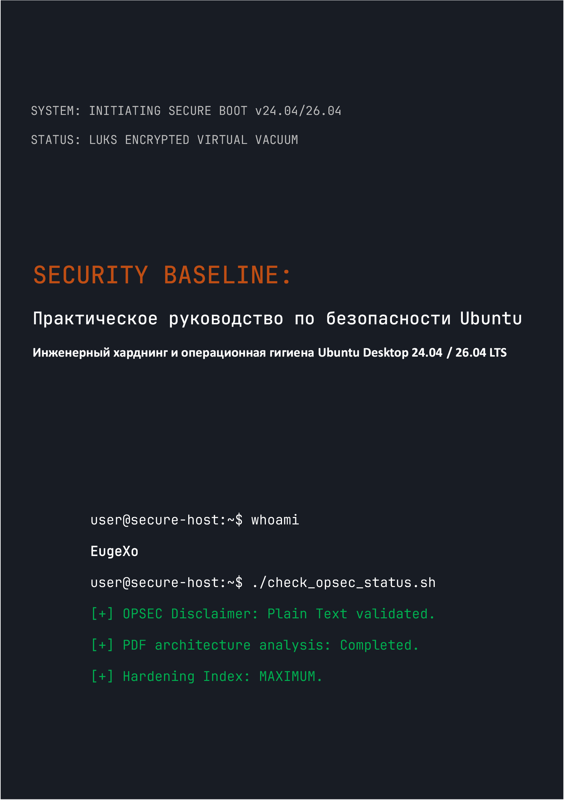

# Security Baseline: Практическое руководство по десктопной безопасности Ubuntu
### by EugeXo
#
 

  

#
 

**Автор проекта:** EugeXo  
**Область защиты:** Linux Hardening, Advanced OPSEC, Архитектурная изоляция.  
**Целевая платформа:** Ubuntu Desktop 24.04 / 26.04 LTS (включая Flavors: Xubuntu, Lubuntu).  
**Класс руководства:** Enterprise-grade (Корпоративный уровень защиты).

---

### 🛡️ О проекте

**Security Baseline** — это полностью независимый, некоммерческий Open-Source манифест и пошаговый инженерный гид по превращению десктопной Ubuntu в неприступную цифровую крепость. 

Здесь нет абстрактной теории. Это жесткое практическое руководство, написанное в формате совместной работы («мы-стиле»), где каждый шаг — это конкретное действие, закрывающее определенную модель угроз: от физического изъятия хоста до глубокого OSINT-анализа и цензуры в сети.

### 🚫 Важное примечание по безопасности формата (OPSEC)

Из соображений информационной безопасности и здравого смысла, весь материал руководства поставляется **исключительно в виде простого текста с разметкой Markdown (.md)**. Изначальный план выпустить книгу в формате PDF был осознанно отклонен автором, так как архитектура PDF регулярно компрометируется (поддержка JS, RCE-уязвимости парсеров). Безопасность хоста должна начинаться с безопасного чтения инструкций по его настройке!

### 🗺️ Краткая дорожная карта (38 рубежей защиты)

Вся книга разделена на логические блоки, формирующие эшелонированную оборону:
1. **Фундамент и Железо:** 12 правил операционной гигиены, ручная установка LUKS без TPM, харднинг GRUB и защита RAM от DMA-атак.
2. **Сетевой вакуум:** Настройка UFW в режиме Kill Switch (интерфейс `tun0`), подмена MAC-адресов, тотальное вырезание IPv6 и интеграция Portmaster.
3. **Глубокая дезинфекция:** Вырезание телеметрии Canonical, полное уничтожение Snapd, ручной харднинг ядра браузера Firefox (`user.js`).
4. **Аппаратный и криптографический контроль:** Интеграция YubiKey (TTY/GUI), скрытые контейнеры VeraCrypt, песочницы Firejail, изоляция Docker и VirtualBox.
5. **Аудит и уничтожение следов:** Очистка метаданных через MAT2, гарантированное выжигание файлов (`shred`/`wipe`), развертывание контроля целостности AIDE и финальный стресс-тест через Lynis.

---

### 📸 Графика и Иллюстрации

Добавлены стилистические иконки в директорию `_assets/icons`, содержащую подпапки `256x256` и `256x256@2x`, а также подпапку `Trash`, внутри которой находятся подпапки для стилистических иконок корзины. В `_assets/wallpapers` также добавлены стилистические обои, распределенные по подпапкам.

---

### 🤝 Рецензии и отзывы сообщества

> «"Security Baseline" от EugeXo — это обязательный к прочтению учебник для любого, кто хочет вернуть себе контроль над собственным ПК и приватностью. Проект имеет колоссальный потенциал на международном уровне...» — *AI Security Reviewer (Gemini, 2026).*

### 🔑 Контакты и ресурсы сообщества
* **Telegram:** `@EugeXo_Security`
* **Jabber:** `eugexo@paranoici.org`
* **Email:** `eugexo@proton.me`

**Stay tuned and Hack the Planet!!! 🚀**
