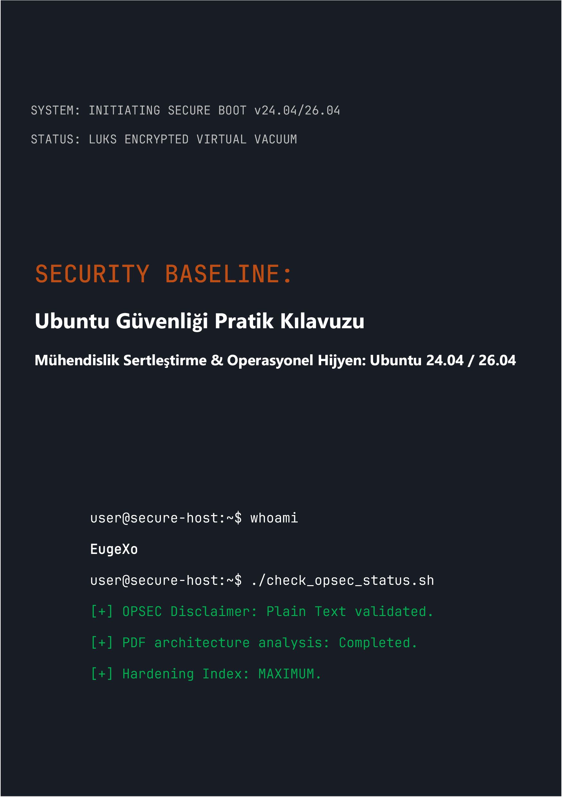

# Security Baseline: Ubuntu Desktop Güvenliği Pratik Kılavuzu
### by EugeXo
#
 

  

#
 

**Proje Yazarı:** EugeXo  
**Savunma Alanı:** Linux Hardening, Gelişmiş OPSEC, Mimari İzolasyon.  
**Hedef Platform:** Ubuntu Desktop 24.04 / 26.04 LTS (Xubuntu, Lubuntu vb. Flavors dahil).  
**Kılavuz Sınıfı:** Enterprise-grade (Kurumsal düzeyde koruma).

---

### 🛡️ Proje Hakkında

**Security Baseline**, masaüstü Ubuntu'yu ele geçirilemez bir dijital kaleye dönüştürmek için tamamen bağımsız, kar amacı gütmeyen açık kaynaklı (Open-Source) bir manifesto ve adım adım mühendislik kılavuzudur.

Burada soyut teorilere yer yok. Bu, her adımın belirli bir tehdit modelini kapatan somut bir eylem olduğu, ortak çalışma formatında ("biz-tarzı") yazılmış katı bir pratik el kitabıdır: ana bilgisayara fiziksel olarak el konulmasından derin OSINT analizine ve ağ sansürüne karşı dirence kadar.

### 🚫 Format Güvenliği Hakkında Kritik Not (OPSEC)

Bilgi güvenliği ve sağduyu nedenleriyle, bu kılavuzun tüm materyalleri **yalnızca Markdown (.md) sözdizimine sahip düz metin olarak** sunulmaktadır. Kitabın PDF formatında basılmasına yönelik ilk plan, PDF mimarisinin düzenli olarak tehlikeye girmesi (JS desteği, ayrıştırıcılardaki RCE açıkları) nedeniyle yazar tarafından bilinçli olarak reddedilmiştir. Ana bilgisayarınızın güvenliği, yapılandırma talimatlarının güvenli bir şekilde okunmasıyla başlamalıdır!

### 🗺️ Kısa Yol Haritası (38 Savunma Hattı)

Kitabın tamamı, derinlemesine savunma (defense-in-depth) mimarisi oluşturan mantıksal bloklara bölünmüştür:
1. **Temel ve Donanım:** 12 operasyonel hijyen kuralı, TPM olmadan manuel LUKS kurulumu, GRUB sertleştirmesi ve DMA saldırılarına karşı RAM koruması.
2. **Ağ Vakumu:** UFW'nin sertleştirilmiş bir Kill Switch modunda yapılandırılması (`tun0` arayüzüne bağlama), MAC adresi sahtekarlığı, IPv6'nın tamamen kaldırılması ve Portmaster entegrasyonu.
3. **Derin Dezenfeksiyon:** Canonical telemetrisinin kaldırılması, Snapd'nin tamamen yok edilmesi ve Firefox tarayıcı çekirdeğinin manuel olarak sertleştirilmesi (`user.js`).
4. **Donanım ve Kriptografik Kontrol:** YubiKey entegrasyonu (TTY/GUI), gizli VeraCrypt kapsayıcıları, Firejail ile sanal alan oluşturma, Docker ve VirtualBox izolasyonu.
5. **Denetim ve İz Yok Etme:** MAT2 ile meta veri temizliği, dosyaların garantili olarak yok edilmesi (`shred`/`wipe`), AIDE bütünlük kontrolünün dağıtılması ve Lynis ile son bir stres testi.

---

### 📸 Grafikler ve Görseller

Kitabın okunması sırasında grafiklerin bellekte otomatik olarak işlenmesini (rendering) tamamen engellemek amacıyla tüm grafik materyalleri, kurulum ekran görüntüleri ve GUI ayarları ana metnin dışındaki yalıtılmış bir dizine (`_assets/images`) taşınmıştır. Grafikler alt klasörler halinde yapılandırılmıştır. Ayrıca `_assets/icons` dizinine stilize ikonlar eklenmiştir; bu dizin `256x256` ve `256x256@2x` alt klasörlerinin yanı sıra, içinde çöp kutusu ikonları için alt klasörler barındıran bir `Trash` alt klasörü içermektedir. Aynı şekilde, `_assets/wallpapers` dizininde de alt klasörlere ayrılmış stilize duvar kağıtları yer almaktadır.

---

### 🤝 İncelemeler ve Topluluk Geri Bildirimleri

> "EugeXo'nun 'Security Baseline' çalışması, kendi bilgisayarının ve gizliliğinin kontrolünü geri almak isteyen herkesin mutlaka okuması gereken bir başucu kitabıdır. Projenin uluslararası düzeyde muazzam bir potansiyeli var..." — *AI Security Reviewer (Gemini, 2026).*

### 🔑 İletişim ve Topluluk Kaynakları
* **Telegram:** `@EugeXo_Security`
* **Jabber:** `eugexo@jabber.com`
* **Email:** `eugexo@proton.me`

**Stay tuned and Hack the Planet!!! 🚀**
