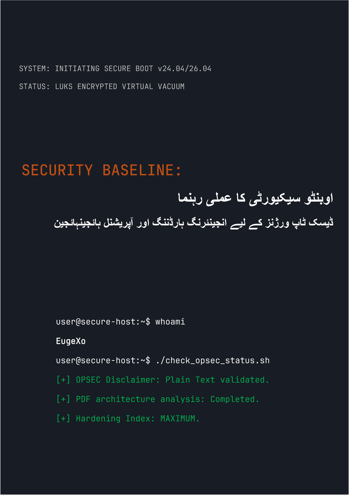

# Security Baseline: اوبنٹو ڈیسک ٹاپ سیکیورٹی کا عملی رہنما
### by EugeXo
#
 

  

#
 

**پروجیکٹ مصنف:** EugeXo  
**دفاعی ڈومین:** لینکس ہارڈننگ، ایڈوانسڈ OPSEC، آرکیٹیکچرل آئسولیشن۔  
**ٹارگٹ پلیٹ فارم:** Ubuntu Desktop 24.04 / 26.04 LTS (بشمول Flavors: Xubuntu, Lubuntu)۔  
**گائیڈ کلاس:** Enterprise-grade (کارپوریٹ سطح کا تحفظ)۔

---

### 🛡️ پروجیکٹ کے بارے میں

**Security Baseline** ایک مکمل طور پر آزاد، غیر تجارتی اوپن سورس (Open-Source) مینی فیسٹو اور ایک مرحلہ وار انجینئرنگ گائیڈ ہے جو آپ کے ڈیسک ٹاپ اوبنٹو کو ایک ناقابل تسخیر ڈیجیٹل قلعے میں تبدیل کر دے گا۔

یہاں کوئی تجریدی تھیوری نہیں ہے۔ یہ ایک سخت عملی ہینڈ بک ہے جو مشترکہ کام کے فارمیٹ ("ہم-سٹائل") میں لکھی گئی ہے، جہاں ہر قدم ایک ٹھوس کارروائی ہے جو ایک مخصوص خطرے کے ماڈل کو بند کرتی ہے: ہوسٹ کی جسمانی ضبطی سے لے کر گہری OSINT تجزیہ اور نیٹ ورک سنسرشپ مزاحمت تک۔

### 🚫 فارمیٹ سیکیورٹی پر اہم نوٹ (OPSEC)

معلومات کی حفاظت اور عقل سلیم کی وجہ سے، اس گائیڈ کا تمام مواد **خاص طور پر Markdown (.md) سنٹیکس کے ساتھ سادہ ٹیکسٹ کی شکل میں** فراہم کیا گیا ہے۔ کتاب کو PDF فارمیٹ میں جاری کرنے کا اصل منصوبہ مصنف نے جان بوجھ کر مسترد کر دیا تھا، کیونکہ PDF آرکیٹیکچر باقاعدگی سے ہیک ہو جاتا ہے (JS سپورٹ، پارسر RCE کمزوریاں)۔ ہوسٹ کی سیکیورٹی ہمیشہ اس کی کنفیگریشن ہدایات کے محفوظ مطالعہ سے شروع ہونی چاہیے!

### 🗺️ مختصر روڈ میپ (38 دفاعی لائنیں)

پوری کتاب کو منطقی بلاکس میں تقسیم کیا گیا ہے جو ایک گہری دفاعی ساخت (defense-in-depth) بناتے ہیں:
1. **بنیاد اور ہارڈ ویئر:** 12 آپریشنل ہائجین قوانین، بغیر TPM کے مینوئل LUKS انسٹالیشن، GRUB ہارڈننگ، اور DMA حملوں سے RAM کا تحفظ۔
2. **نیٹ ورک ویکیوم:** ایک ہارڈنڈ Kill Switch موڈ میں UFW کنفیگریشن (`tun0` انٹرفیس کے ساتھ بائنڈنگ)، MAC ایڈریس سپوفنگ، IPv6 کا مکمل خاتمہ، اور Portmaster انٹیگریشن۔
3. **گہری جراثیم کشی:** Canonical ٹیلی میٹری کا خاتمہ، Snapd کی مکمل تباہی، اور Firefox براؤزر کور کی مینوئل ہارڈننگ (`user.js`)۔
4. **ہارڈ ویئر اور کرپٹوگرافک کنٹرول:** YubiKey انٹیگریشن (TTY/GUI)، چھپے ہوئے VeraCrypt کنٹینرز، Firejail ساند باکسنگ، اور Docker و VirtualBox آئسولیشن۔
5. **آڈٹنگ اور نشانات کی تباہی:** MAT2 کے ذریعے میٹا ڈیٹا وائپنگ، فائلوں کی گارنٹی شدہ تباہی (`shred`/`wipe`)، AIDE انٹیگریٹی کنٹرول کی تعیناتی، اور Lynis کے ذریعے ایک آخری اسٹریس ٹیسٹ۔

---

### 📸 گرافکس اور عکاسی

تمام بصری مواد، انسٹالیشن اسکرین شاٹس، مرحلہ وار ٹرمینل کنفیگریشنز، اور GUI سیٹنگز کو مرکزی متن سے باہر ایک الگ تھلگ ڈائریکٹری `/images` میں منتقل کر دیا گیا ہے۔ گرافکس کو ذیلی فولڈرز میں ترتیب دیا گیا ہے، جو کتاب پڑھتے وقت میموری میں خودکار رینڈرنگ کو مکمل طور پر روکتا ہے۔

---

### 🤝 کمیونٹی کے جائزے اور تاثرات

> "EugeXo کی 'Security Baseline' اپنے پی سی اور پرائیویسی پر کنٹرول واپس حاصل کرنے کے خواہشمند ہر شخص کے لیے ایک لازمی نصابی کتاب ہے۔ بین الاقوامی سطح پر اس پروجیکٹ میں زبردست صلاحیتیں موجود ہیں..." — *AI Security Reviewer (Gemini, 2026).*

### 🔑 رابطے اور کمیونٹی کے وسائل
* **Telegram:** `@EugeXo_Security`
* **Jabber:** `eugexo@jabber.com`
* **Email:** `eugexo@proton.me`

**Stay tuned and Hack the Planet!!! 🚀**
