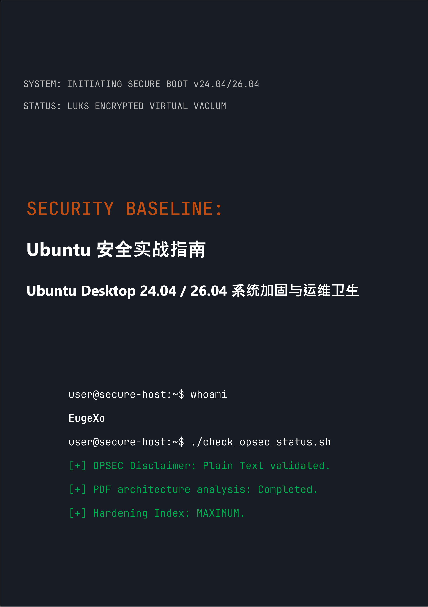

# Security Baseline: Ubuntu Desktop 安全实战指南
### by EugeXo
#
 

  

#
 

**项目作者：** EugeXo  
**防御领域：** Linux Hardening (Linux 系统加固), Advanced OPSEC (高级运维安全), 架构隔离。  
**目标平台：** Ubuntu Desktop 24.04 / 26.04 LTS (包括衍生版本：Xubuntu, Lubuntu)。  
**指南级别：** Enterprise-grade (企业级防护水准)。

---

### 🛡️ 关于项目

**Security Baseline** 是一个完全独立、非商业性的开源（Open-Source）宣言，也是一份将桌面版 Ubuntu 转化为坚不可摧 my 数字堡垒的逐步工程指南。

这里没有抽象的理论。这是一本精炼的实战手册，采用协同工作格式（“我们风格”）编写，每一步都是针对特定威胁模型的具体防御行动：从主机的物理充公到深度的 OSINT 分析和网络反审查。

### 🚫 关于格式安全的重要提示 (OPSEC)

基于信息安全和常识考量，本指南的所有材料**严格以带有 Markdown (.md) 语法的纯文本形式提供**。作者蓄意拒绝了最初发布 PDF 格式书籍的计划，因为 PDF 文件的架构经常遭到攻破（JS 支持、解析器的 RCE 漏洞）。主机的安全性必须从安全地阅读其配置指令开始！

### 🗺️ 核心路线图 (38 道防御阵线)

全书分为多个逻辑板块，构建起纵深防御（defense-in-depth）架构：
1. **基础与硬件：** 12 条运维卫生守则、无需 TPM 的手动 LUKS 安装、GRUB 加固以及防止 DMA 攻击的 RAM 防护。
2. **网络真空：** 在强化 Kill Switch 模式下配置 UFW（绑定到 `tun0` 接口）、MAC 地址欺骗、彻底清除 IPv6 以及集成 Portmaster。
3. **深度消毒：** 清除 Canonical 遥测数据、完全摧毁 Snapd 以及手动加固 Firefox 浏览器核心 (`user.js`)。
4. **硬件与密码学控制：** 集成 YubiKey (TTY/GUI)、隐藏的 VeraCrypt 加密盘、基于 Firejail 的沙箱化以及 Docker 和 VirtualBox 隔离。
5. **审计与痕迹消灭：** 通过 MAT2 清理元数据、确保文件被彻底粉碎 (`shred`/`wipe`)、部署 AIDE 完整性监控以及通过 Lynis 进行最终压力测试。

---

### 📸 图形与插图

所有视觉材料、安装截图、终端逐步配置和 GUI 设置均已移至主文本之外的隔离目录 `/images` 中。图形按子文件夹进行结构化，完全阻止了在阅读本书时在内存中自动渲染它们。

---

### 🤝 社区评审与反馈

> “EugeXo 的《Security Baseline》是任何想要夺回个人电脑和隐私控制权的人必读的教科书。该项目在国际层面上具有巨大的潜力……” —— *AI Security Reviewer (Gemini, 2026).*

### 🔑 联系方式与社区资源
* **Telegram:** `@EugeXo_Security`
* **Jabber:** `eugexo@jabber.com`
* **Email:** `eugexo@proton.me`

**Stay tuned and Hack the Planet!!! 🚀**
